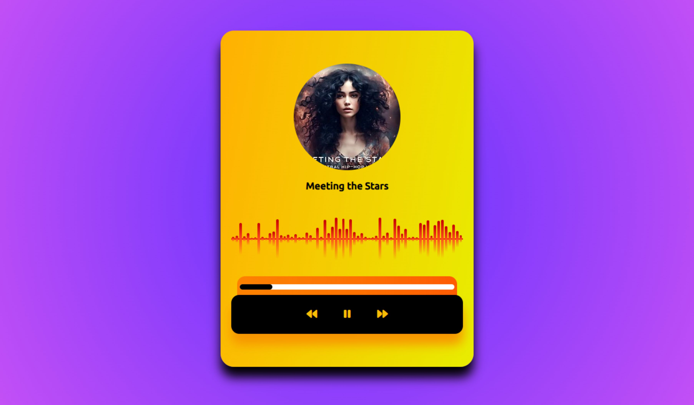

# App Music Player

## Sobre o projeto

Um player de música simples, que toca algumas músicas pré definidas, onde é possível pausar, avançar ou retroceder as faixas.

## Como utilizar

Para utilizar basta clicar no botão play para tocar, pause para pausar ou nos botões retroceder ou avançar.

## Informações

Projeto desenvolvido utilizando apenas HTML, CSS e JavaScript.

